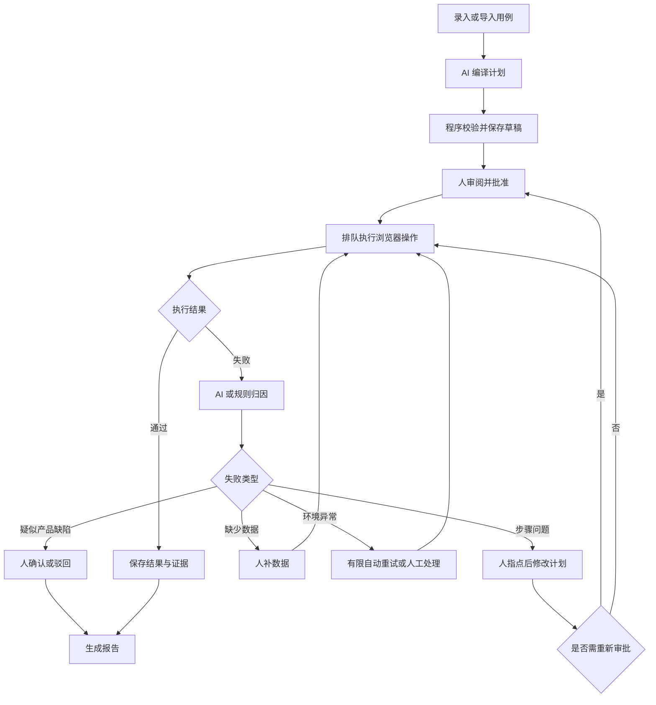
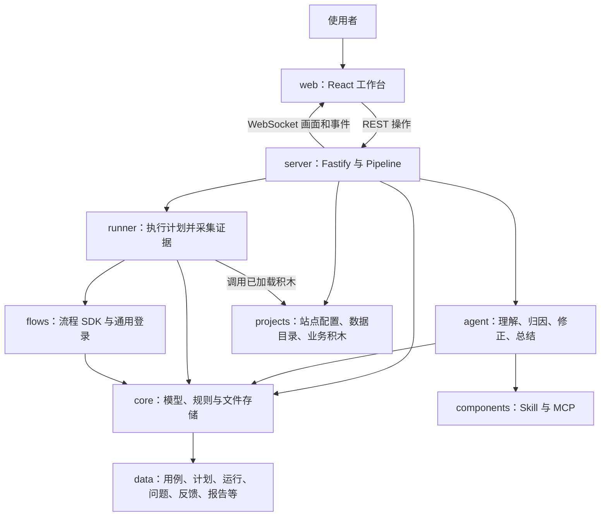

# UI Test Agent：项目理解、使用与扩展指南

本文面向第一次接触项目的同事、测试负责人和后续维护者。依据工作区的源码、配置与测试定义整理；“现有能力”指代码已实现，“建议”指尚需开发的工作。本次为静态分析，未运行真实 MolarData 测试或调用付费模型。

## 1. 先用日常语言理解这个项目

这是一个把“测试说明”变成“浏览器操作”，并帮助人处理失败、整理证据的平台。

例如，你写“修改昵称后，页面应该显示新昵称”。平台让 AI 把这句话拆成打开页面、填写输入框、点击保存、检查显示内容等步骤。人先检查步骤是否正确，再让浏览器执行。执行失败后，平台帮助区分是步骤写错、缺少数据、环境异常，还是产品真的有问题。

可以把它看成一个测试工作小组：

| 分工 | 在项目中的对应物 | 负责什么 |
| --- | --- | --- |
| 测试需求说明 | TestCase，用例 | 说明要验证的行为和预期 |
| 写操作说明的人 | compiler，编译角色 | 把用例转换成结构化计划 |
| 经审阅的操作单 | StepPlan，计划 | 明确执行顺序、数据和检查点 |
| 操作浏览器的人 | runner，执行器 | 按计划操作网页并记录结果 |
| 帮忙调查的人 | triager，归因角色 | 根据错误和证据提出失败原因 |
| 负责修改操作单的人 | repairer，修正角色 | 根据人的反馈生成新版本计划 |
| 测试负责人 | 使用平台的人 | 批准计划、确认缺陷、处理异常 |
| 流程管理员 | Pipeline | 决定现在能做什么、下一步去哪 |

项目的主要价值是把测试工作串成可追踪的闭环。AI 降低写步骤、分析失败的成本；浏览器执行器让操作可以重复；人和程序规则共同决定什么结果能被接受。

## 2. 适合在哪些场景使用

| 场景 | 如何使用 | 收益与前提 |
| --- | --- | --- |
| Web 功能回归 | 把常测功能录成用例，批准计划后重复执行 | 复用计划；页面定位、账号和数据必须稳定 |
| 把功能点清单转成测试 | 导入 Markdown 清单，结合项目知识展开步骤 | 减少从需求到自动化步骤的转换工作；自由文本需要真实模型 |
| 调查自动化失败 | 查看失败步骤、截图、录像和 trace，再提供反馈 | 将脚本问题、数据问题与产品缺陷分开处理 |
| 让业务人员参与测试 | 业务人员确认预期，测试人员维护数据和定位，开发维护积木 | 不要求每个使用者都会写 Playwright，但仍需有人维护底层能力 |
| 将经验带到另一个网站 | 复用平台，新增该网站的配置、知识和业务积木 | 通用流程复用，业务页面差异集中管理 |

目前最匹配的是本机或受控团队环境中的 Web 功能测试。移动端原生应用、压测、复杂 Canvas/WebGL 坐标操作需要额外执行能力。源码中的浏览器启动使用 Chromium，不能直接把现状描述成已支持多浏览器矩阵。

## 3. 一次测试如何完成



“门禁”就是一个检查站：条件不满足时，流程停下来等补充信息或审批。

四种失败分别是：

| 类型 | 通俗解释 | 处理路径 |
| --- | --- | --- |
| `step-defect` | 操作说明不对，例如按钮名称写错 | 人提供正确名称或修改步骤，生成新计划并重跑 |
| `data-missing` | 缺少兑换码、素材、账号等前提 | 补充相应数据或配置后再跑 |
| `env-flaky` | 网络、站点或后端偶发异常 | 默认同一计划版本自动重试 1 次，后续交人处理 |
| `product-defect` | 执行到验证点，实际结果与预期不符 | 进入结果审阅，由人确认是不是缺陷 |

默认 `maxRounds=3`，代码以 `round > maxRounds` 判断升级；人工反馈后的重跑会增加轮次，环境自动重试保留当前轮次。它限制自动推进，并不禁止人工继续处理。

已批准的计划内容通过新版本修正，旧版本保留追溯关系。取消后的执行结果不能把“已取消”改回“成功”，这是执行令牌和终态检查负责的事情。

## 4. 第一次如何使用

### 4.1 先跑本地演示

项目声明 Node.js 22 以上，使用 pnpm 工作区。根目录脚本提供以下入口：

```bash
cd /Users/sunqian/Desktop/Projects/ui-test-agent
pnpm install
pnpm playwright:install
```

启动前先明确模型配置。当前 `config/llm.yaml` 虽然写着 `default: mock`，但同时把 `compiler` 和 `repairer` 指向 `ppapi`，因此直接启动时这两个角色会走真实模型。

要进行纯离线演示，可先将模型配置设为以下最小内容，或保留现有 providers 并把所有角色路由改为 mock：

```yaml
default: mock
providers:
  mock:
    type: mock
roles: {}
```

```bash
LLM_PROVIDER=mock pnpm start
```

环境变量只覆盖默认 provider；如果保留 `roles.compiler: ppapi`，即使设置 `LLM_PROVIDER=mock`，编译角色仍然使用 ppapi。以启动日志或 `/api/health` 返回的五个角色路由为准。

启动后打开 `http://127.0.0.1:4600`。开发模式使用 `pnpm dev`，前端默认在 `http://127.0.0.1:5173`，服务端在 4600。

按界面操作：

1. **① 用例录入**：选择演示项目，查看首次启动导入的四条用例。
2. **② 步骤编译**：逐条编译，检查操作和预期，再批准。
3. **③ 执行直播**：选择用例执行，观察实时画面、步骤与日志。
4. **④ 失败门禁**：昵称用例提供 `按钮叫「保存」`；VIP 用例补 `vipCode=VIP-2026`，等待重跑。
5. **⑤ 结果审阅**：待办计数用例用于展示产品缺陷，确认后生成报告。
6. **⑥ 组件中心**：检查 Skill、MCP 和待审批组件；不是每次测试的必经步骤。

演示中的失败是有意安排的：分别说明“步骤写错”“数据缺失”“产品缺陷”。mock 是用于规范句式的规则引擎，不能代表真实模型对任意业务描述的理解能力。

### 4.2 接入真实 MolarData 环境

当前接入配置位于 `projects/molardata/project.yaml`。准备：

- `MOLAR_BASE_URL`：可访问的测试环境地址；默认是无效占位地址。
- `MOLAR_ADMIN_USERNAME`、`MOLAR_ADMIN_PASSWORD`：测试账号；也支持配置中指定的外部 `.env` 回退值。
- 真实模型所需的 provider、角色路由与对应密钥。
- `test-data.yaml` 中需要的任务、节点、素材，以及要导入的 Markdown 清单目录。

平台执行前会检查缓存登录态，失效时表单登录，并保存到 `data/auth/<projectId>/`。当前 MolarData 配置已经采用这个方式；README 中先在外部工程执行 `auth:all` 的描述属于另一种登录态接入方式，不是当前配置的必需步骤。

`molar.ensureTask` 能查找或创建任务，但新任务不自动具备标签、已导入数据、有数据节点等全部业务前提。测试“删除有数据的节点”时仍须准备相应状态。

账号配置、项目配置和积木在启动时加载；手动修改这些配置后应重启服务。组件中心批准 Skill 的热加载是另一条机制，不应混为一谈。

### 4.3 人需要检查什么

批准计划时，重点看它是否验证了原用例的意图、用了正确账号和数据、有没有把错误的产品结果当成“正确预期”。

确认缺陷时，核对预期、实际和证据。报告 `final` 表示当前没有未处理的 Finding，**不表示所有用例都执行过或全部通过**；目前报告按项目汇总每个用例最近一次未取消的执行，没有独立的发布批次概念。

## 5. 技术架构与目录职责

这是 TypeScript + pnpm workspace 的模块化单体：前端提供界面，一个 Fastify 服务组装 Agent、执行器、规则和存储。源码分成多个包，不等于它们已经是独立部署的微服务。



| 目录 | 职责 | 何时修改 |
| --- | --- | --- |
| `packages/core` | Zod 数据定义、状态规则、计划校验、文件存储 | 增加领域字段、改变门禁、迁移存储 |
| `packages/agent` | 模型协议适配、工具调用循环、角色、组件注册、业务服务 | 新增模型协议、Agent 工具或职责 |
| `packages/runner` | 把结构化动作映射为 Playwright 调用，采集截图、录像、trace | 增加操作类型、执行策略和浏览器能力 |
| `packages/flows` | 流程积木 SDK、状态读写、通用登录和会话复用 | 跨项目共用的确定性流程 |
| `packages/server` | REST 接口、事件总线、队列、流水线、导入、报告、项目装配 | 新增业务入口、编排规则或服务能力 |
| `packages/web` | 六个工作页面及通用 UI | 展示新能力、修改人的操作流程 |
| `components/skills` | 给 Agent 的方法、规则和项目知识 | 补充业务知识、改善编译或归因指引 |
| `components/mcp`、`mcp.json` | 外部可执行工具及注册配置 | 接 OBS、其他服务或工具 |
| `projects/<id>` | 项目配置、测试数据、该项目的业务积木 | 接入新网站、修改业务路径或定位 |
| `tests/e2e` | 用真实服务和浏览器验证平台整体闭环 | 跨模块功能或人的完整操作流程变化 |
| `data` | 运行产生的 JSON、证据、会话和业务状态 | 运行数据，不应当成业务源码维护 |

服务组装入口是 `packages/server/src/server.ts` 的 `startServer()`，主要业务编排在 `pipeline.ts`。开发者可以从这两个文件建立全局认识，再按上表进入相关模块。

## 6. 架构中值得理解的几个设计

### 6.1 AI 输出结构化计划，浏览器执行已批准计划

Step DSL 是“步骤数据格式”，如：

```json
[
  { "id": "s1", "stage": "action", "action": "click", "target": { "role": "button", "name": "保存" } },
  { "id": "s2", "stage": "verify", "action": "assertText", "target": { "testId": "nickname" }, "expect": "新昵称" }
]
```

这是说明格式的示例，具体定位必须以实际页面为准。计划还可以声明测试数据 `data`、选择理由 `decisions`、登录角色等。

AI 调用 `propose_plan` 提交计划，程序检查动作参数、积木参数、数据引用和断言等条件。不合格时把问题反馈给模型修改。审核通过的计划由执行器解释执行，执行期间不调用 LLM 来决定每次点击。

因此，同一个计划可以重复运行，并保留“当时批准的是什么”。页面、数据、生成值和环境仍可能变化，不能把确定性的执行逻辑理解为每次结果必然相同。

### 6.2 Agent 角色和业务状态机各管一层

`runAgent()` 是“模型回应 → 调用允许的工具 → 把结果交回模型”的循环，默认最多 10 轮。角色由提示词、工具集合和所需 Skill 区分。

`Pipeline` 是“草稿 → 批准 → 执行 → 归因 → 反馈 → 重跑”的业务控制。是否能执行、是否需要重新批准、哪些反馈有效，由程序规则检查。

这里的五个 Agent 角色是共享框架中的阶段分工。`orchestrator` 主要处理开放请求和组件草稿，实际测试排队和重跑由 Pipeline 控制。

### 6.3 数据对象分开保存，保留追踪关系

| 对象 | 回答的问题 |
| --- | --- |
| TestCase | 原来想测试什么？ |
| StepPlan | 哪个版本的操作被批准了？ |
| Run | 哪一次执行、用了哪版计划、结果如何？ |
| Finding | 为什么失败、目前谁需要处理？ |
| Feedback | 人提供了什么修正或判定？ |
| Report | 生成报告时有哪些结果与未处理事项？ |

`derivedFrom` 连接修正计划与原计划、失败项、人工反馈。`attemptId` 防止过期执行者回写结果。存储通过临时文件改名和进程内锁写入 JSON，并在读写时校验结构。

这些记录支持追溯，但不等于不可篡改的审计系统。当前文件锁只保证单进程内的相应操作串行。

### 6.4 直播、证据和规则降级提高可解释性

Chromium 的 CDP screencast 经 WebSocket 推送画面；每步截图、整段录像、trace 保存到数据目录。失败时还尝试采集 ARIA 快照，帮助理解页面上有哪些元素。

归因 Agent 出错时，Pipeline 会使用规则归因；缺数据也可以直接由规则判断。生成报告的 AI 总结失败时，结构化报告仍可生成。自由文本编译则不能假设有同等能力的规则回退。

## 7. 如何复用：选择正确的扩展位置

| 要解决的问题 | 应使用什么 | 示例 |
| --- | --- | --- |
| 更换环境地址、账号、语言或超时 | 项目配置 | 换一个 MolarData 测试环境 |
| AI 不知道业务规则、页面入口或用词 | Skill | 告诉 AI 哪些节点不可删除 |
| 很多用例都要重复做一段浏览器操作 | Flow 积木 | 找到一个任务并打开工作流页 |
| AI 要调用外部系统或工具 | MCP | 查询外部测试数据或控制 OBS |
| 现有步骤格式表达不了新动作 | 核心 DSL 与 runner | 新增拖拽、下载验证或图片比较 |
| 需要团队级调度和权限 | server、store、部署层 | 并发 worker、身份认证、持久队列 |

**Skill 是说明，Flow 是可重复执行的业务代码，MCP 是外部工具接口。**

Skill 本身不会给 runner 增加动作；注册 MCP 也不会自动让 Step DSL 多出一个执行指令。需要在测试执行中重复使用、共享当前页面和证据的能力，优先封装为 Flow。需要给模型使用的外部工具再考虑 MCP。

### 7.1 现有 MolarData 积木的复用方式

`molar.ensureTask` 按顺序查找人工目录中的任务、之前记住的任务、指定名称的自动化任务，最后才创建任务，输出 `taskId` 和 `taskName`。

`molar.openTaskPage` 使用任务 ID 打开指定子页面，并检查加载情况。

后续步骤通过 `${data.taskId}` 引用前面积木的输出。校验器会检查是否在输出产生之前就引用它。登录由通用会话层处理，各条业务用例不必重复写登录。

这样，多个任务用例可以共用前置流程；页面路径或查找逻辑改变时，维护积木即可。但已批准计划目前只记录积木 ID 和参数，未固定积木代码版本，修改积木仍可能影响旧计划的实际行为。

### 7.2 把当前平台用于另一个网站

1. 新建 `projects/<新项目>/project.yaml`，配置 ID、名称和 baseURL，需要时配置 login。
2. 新建 `test-data.yaml`，登记可复用业务数据和素材。
3. 需要领域知识时，增加 `components/skills/<项目知识>/SKILL.md`，在 `knowledgeSkills` 中引用。
4. 把重复前置操作写成 `projects/<新项目>/flows/index.ts`，默认导出积木数组。
5. 重启服务，先验证一条最小用例，再逐步加入业务场景。

最小项目配置示例：

```yaml
id: customer-portal
name: 客户门户测试
baseURL: ${PORTAL_BASE_URL:-http://127.0.0.1:3000}
```

当前 Markdown 导入器在 source 前缀和说明中仍有 MolarData 特定内容。接入第二个项目时，应将它抽象为通用 importer；不能只新增一个文件路径就认为各类外部用例格式都已支持。

## 8. 后续开发如何落地

### 8.1 新增业务流程积木

以下为待实现项目的结构示例，展示现有 SDK 的用法；需根据真实页面替换定位并验证：

```ts
import { defineFlow, z } from '@uta/flows'

const openOrders = defineFlow({
  id: 'portal.openOrders',
  description: '打开订单列表并等待列表出现；不创建或删除订单',
  params: z.object({}),
  outputs: [],
  async run(ctx) {
    await ctx.page.goto('/orders', { waitUntil: 'domcontentloaded' })
    await ctx.page.getByTestId('orders-table').waitFor({ state: 'visible' })
  },
})

export default [openOrders]
```

计划用 `{ "action": "use", "flow": "portal.openOrders", "params": {} }` 调用它，实际步骤还需要唯一 `id`。积木代码使用当前测试的 page/context，可以读取目录、持久状态并返回声明的字符串输出；通过 `FlowError` 明确区分环境、缺数据、步骤和断言错误。

验收应覆盖正常路径、缺少前提、页面变化和重复执行。涉及创建数据时要明确复用与清理规则，并检查对其他用例的影响。

### 8.2 新增一类通用动作

例如需要拖拽或验证下载，应同时检查：

| 修改位置 | 工作 |
| --- | --- |
| `core/types.ts` | 新增动作与所需参数定义 |
| `core/gates.ts` | 参数、计划和审批影响校验 |
| `runner/runner.ts` | Playwright 执行、超时、错误分类与证据 |
| `agent` 与相关 Skill | 让模型知道什么时候用、如何填写 |
| `web/steps.ts`、步骤编辑 UI、标签 | 让人能看懂并编辑新动作 |
| runner、core 和必要的端到端测试 | 验证实际行为和前后端闭环 |

只改提示词会让 AI 提交执行器不认识的动作。若需求只属于某个网站，先用 Flow 承载，避免过早扩大通用 DSL。

### 8.3 新增 Skill、MCP 或模型

Skill 由 frontmatter 提供名称、说明和角色信息，正文按需加载。模型先看到目录，再调用 `load_skill` 阅读正文。目录里的角色过滤主要是发现机制，当前 `loadSkillBody(name)` 不独立检查调用者角色，不应把它理解为严格的数据隔离边界。

组件中心可以批准 Agent 起草的 Skill 或 MCP。Skill 批准后重新加载；MCP 批准后以停用状态登记，还需启用。当前 MCP 草稿机制主要生成单个 `server.ts`，新增依赖、测试和部署仍需维护者完成。

接入支持现有协议的模型时，增加 provider 配置和角色路由即可。新协议应实现 `LlmAdapter.chat()`，在 `createAdapter()` 注册，并验证工具调用、图片支持、用量和错误处理。本项目已经具有按角色统计 Token 用量的能力，但用量统计本身不是预算上限。

## 9. 扩展前应处理的现状边界

下表来自当前实现，列出的改进均为建议，本次没有修改这些行为。

| 现状与依据 | 影响 | 建议实现 |
| --- | --- | --- |
| README 未列出 flows，模型和登录说明落后于配置 | 新人可能按错误前提启动 | 同步入门说明；用角色路由输出核对实际模型 |
| `Pipeline.queue` 和 `active` 在内存中，同一时刻一个执行 | 适合小规模；重启不会根据磁盘自动恢复队列 | 增加启动恢复策略、持久任务领取与 worker；先定义中断语义 |
| Store 使用 JSON 文件与进程内锁 | 多进程并发写入、跨对象事务受限 | 根据规模迁移 SQLite/PostgreSQL，增加事务与原子领取 |
| runner 在首个失败处停止后续步骤 | 排在后面的 cleanup 也会被跳过 | 将清理设计成独立 teardown，在失败和取消后仍有明确执行策略 |
| 修正审批比较 steps 的 ID、动作、预期、阶段及 data/decisions，未比较 `flow`、`params` | 更换积木或参数可能被当作小修自动批准 | 将积木与参数变化加入审批判定，并补对应回归测试 |
| 计划未固定 Flow/Skill/配置版本 | 旧计划再次执行时底层行为可能变化 | 记录组件版本、代码版本和配置指纹，明确兼容策略 |
| 报告取各用例最近执行，定稿只检查待处理 Finding | 没有统一测试批次，也不代表发布通过 | 增加 TestSuite/TestBatch；检查未执行、执行中、用例版本和通过率 |
| 当前 app 路由未加入用户认证；`/files/` 挂载整个 dataRoot | 团队部署前必须重新定义访问边界，尤其登录态等运行文件 | 增加身份与项目权限；只开放允许下载的证据和报告目录 |
| `decisions` 是计划中的选择记录，stage 是步骤标签 | 不构成运行时条件分支、循环或自动清理引擎 | 复杂决策先封装为可测试 Flow；确有需要再设计控制流 DSL |

建议顺序：先修正使用说明和影响结果可信度的门禁、清理规则；再把 MolarData 中稳定的高频前置做成积木，并验证第二个项目能复用；随后根据执行量引入批次、恢复与并发。如果近期就要对团队开放网络访问，身份与文件访问边界应提前完成。

## 10. 如何验证后续工作

项目已有 core、agent、server、runner、flows、web、项目积木和 OBS 组件测试，也有 API 与浏览器端到端测试。CI 定义中执行安装、规范检查、类型检查和测试。

```bash
pnpm lint
pnpm typecheck
pnpm test:unit
pnpm test:e2e
pnpm check
```

`pnpm check` 已包含规范、类型和全部测试，不必每次把上面的命令全部重复运行。修改一个积木时先针对该积木验证；跨模块行为改变时再验证完整链路。部分所谓 unit 测试也会启动浏览器，不应据名称判断运行成本。

测试服务通过 `llmProvider: 'mock'` 清空角色覆盖，防止误调用真实模型；测试守卫检查临时文件清理和运行态目录是否被改变。这与普通命令行的 `LLM_PROVIDER` 只改默认 provider 是两种行为。

后续可跟踪首次编译批准率、因脚本问题失败的占比、一次修正后的通过率、人工确认缺陷比例、积木复用次数和每条用例的 Token 用量。当前已有用量记录基础，其他指标需要定义统计口径并实现。

## 11. 给接手者的源码阅读顺序

1. `packages/core/src/types.ts`：认识用例、计划、执行、问题、反馈、报告。
2. `packages/server/src/server.ts`：看模块如何组装。
3. `packages/server/src/pipeline.ts`：看完整业务流程和队列。
4. `packages/core/src/gates.ts`：看哪些规则由程序强制执行。
5. `packages/agent/src/services.ts`、`roles.ts`、`loop.ts`：看模型如何提交可校验结果。
6. `packages/runner/src/runner.ts`：看浏览器动作、失败停止和证据采集。
7. `packages/flows/src/sdk.ts`、`login/session.ts`：看积木契约与自动登录。
8. `projects/molardata/flows/task.ts`：看一个实际业务项目如何接入。
9. `packages/agent/src/registry.ts`：看 Skill/MCP 的注册和审批。
10. `tests/e2e/api-flow.test.ts`：沿测试定义理解完整闭环的预期行为。

以上路径均相对仓库根目录。旧架构文档中的参考项目分析有助于理解设计来源，但接手和扩展时，应以上述实际实现为准。
